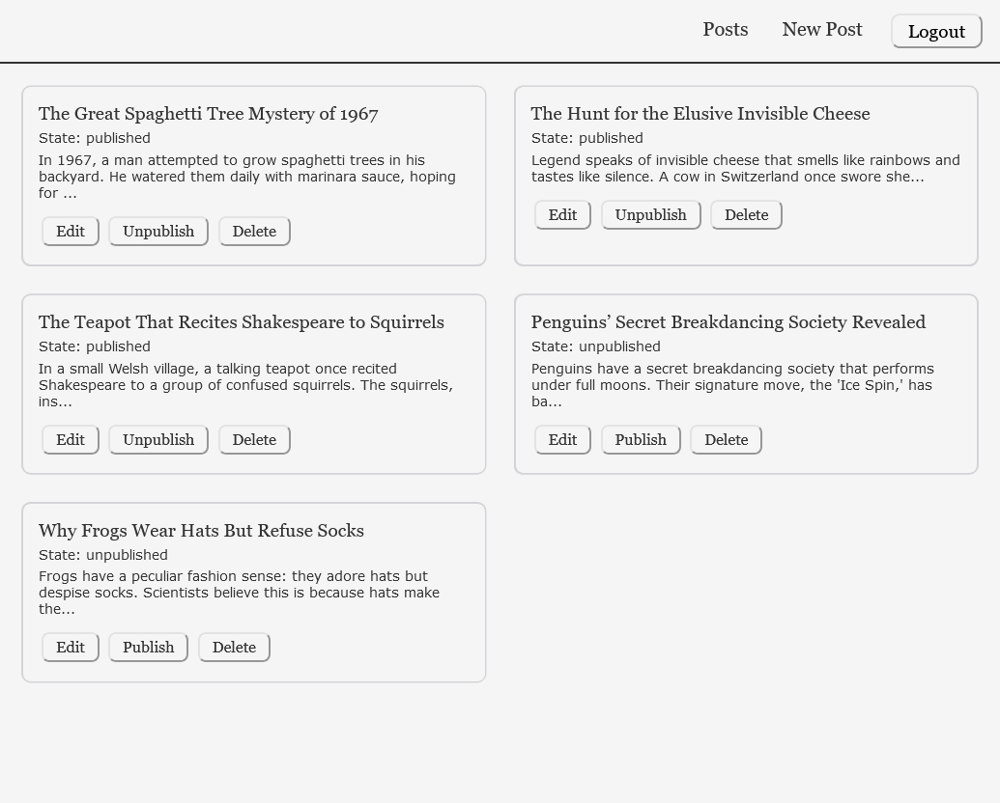
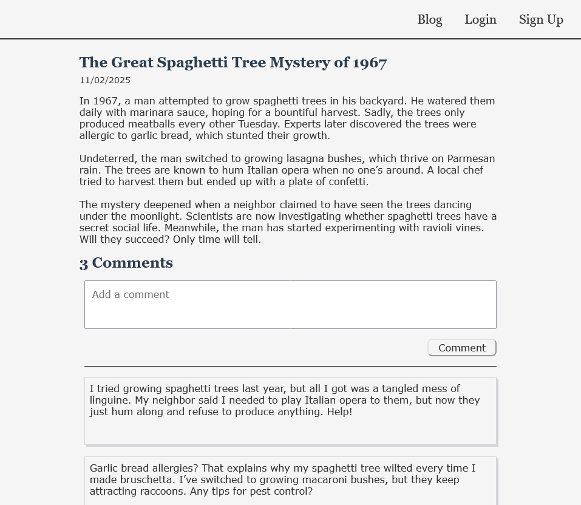

# Blog API

This project allows users to read blog posts and authors to manage content. It consists of three main components:

1. [Viewer App](https://blog-api-viewer-app.netlify.app/) : A frontend where users can view blog posts and comment after logging in.

2. [Creator App](https://blog-api-creator-app.netlify.app/) : A frontend where authors can create and manage blog posts and comments.

3. REST API : A backend that powers both apps, handling user authentication and CRUD operations for posts and comments.

## Screenshots

## Features

- ### Viewer App

  - View all published blog posts.

  - View individual blog posts with comments.

  - Login to comment on posts.

- ### Creator App

  - Includes all features of the viewer app

  - Authors can create, edit, delete, and publish or unpublish blog posts and comments.

- ### REST API

  - Authentication:

    - User registration and login
    - JWT-based authorization.

  - Posts:

    - CRUD operations for blog posts and comments.
    - Publish or unpublish posts.
